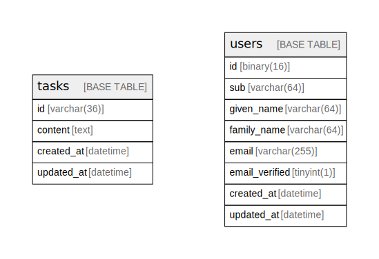

# go playground main db

## Description

go playground main db schema definitions.

## Tables

| Name | Columns | Comment | Type |
| ---- | ------- | ------- | ---- |
| [tasks](tasks.md) | 4 |  | BASE TABLE |
| [users](users.md) | 8 | users is user information | BASE TABLE |

## Relations

---

> Generated by [tbls](https://github.com/k1LoW/tbls)
