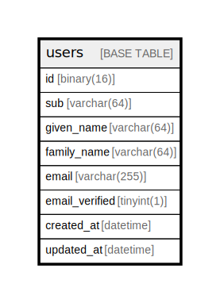

# users

## Description

users is user information

<details>
<summary><strong>Table Definition</strong></summary>

```sql
CREATE TABLE `users` (
  `id` binary(16) NOT NULL COMMENT 'id is user id',
  `sub` varchar(64) COLLATE utf8mb4_bin NOT NULL COMMENT 'sub is jwt subject',
  `given_name` varchar(64) COLLATE utf8mb4_bin NOT NULL COMMENT 'given_name of user',
  `family_name` varchar(64) COLLATE utf8mb4_bin NOT NULL COMMENT 'family_name of user',
  `email` varchar(255) COLLATE utf8mb4_bin NOT NULL COMMENT 'email of user',
  `email_verified` tinyint(1) NOT NULL COMMENT 'email_verified is whether email is verified',
  `created_at` datetime NOT NULL DEFAULT CURRENT_TIMESTAMP,
  `updated_at` datetime NOT NULL DEFAULT CURRENT_TIMESTAMP ON UPDATE CURRENT_TIMESTAMP,
  PRIMARY KEY (`id`),
  UNIQUE KEY `idx_sub` (`sub`) COMMENT 'index for jwt subject'
) ENGINE=InnoDB DEFAULT CHARSET=utf8mb4 COLLATE=utf8mb4_bin COMMENT='users is user information'
```

</details>

## Columns

| Name | Type | Default | Nullable | Extra Definition | Children | Parents | Comment |
| ---- | ---- | ------- | -------- | ---------------- | -------- | ------- | ------- |
| id | binary(16) |  | false |  |  |  | id is user id |
| sub | varchar(64) |  | false |  |  |  | sub is jwt subject |
| given_name | varchar(64) |  | false |  |  |  | given_name of user |
| family_name | varchar(64) |  | false |  |  |  | family_name of user |
| email | varchar(255) |  | false |  |  |  | email of user |
| email_verified | tinyint(1) |  | false |  |  |  | email_verified is whether email is verified |
| created_at | datetime | CURRENT_TIMESTAMP | false | DEFAULT_GENERATED |  |  |  |
| updated_at | datetime | CURRENT_TIMESTAMP | false | DEFAULT_GENERATED on update CURRENT_TIMESTAMP |  |  |  |

## Constraints

| Name | Type | Definition |
| ---- | ---- | ---------- |
| idx_sub | UNIQUE | UNIQUE KEY idx_sub (sub) |
| PRIMARY | PRIMARY KEY | PRIMARY KEY (id) |

## Indexes

| Name | Definition |
| ---- | ---------- |
| PRIMARY | PRIMARY KEY (id) USING BTREE |
| idx_sub | UNIQUE KEY idx_sub (sub) USING BTREE |

## Relations



---

> Generated by [tbls](https://github.com/k1LoW/tbls)
